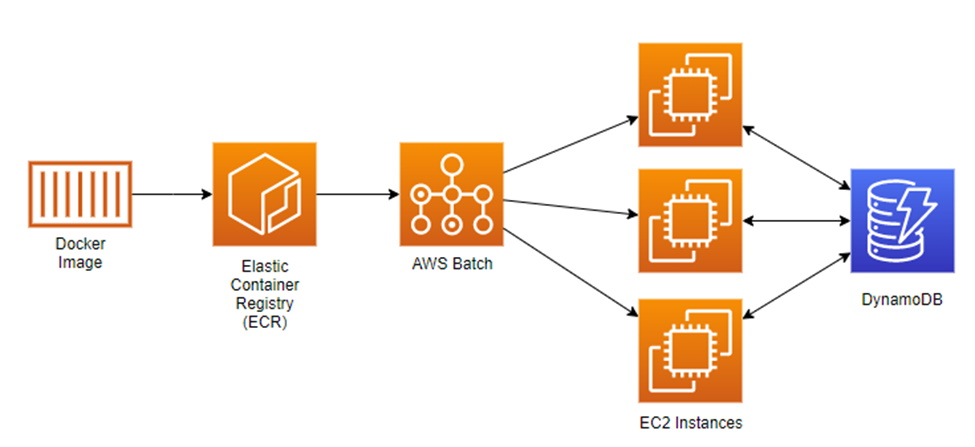
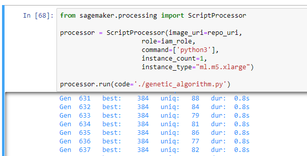

# Genetic Algorithm Example on AWS
This repo contains sample code that accompanies the blog post "Using Genetic Algorithms on AWS for Optimization".  This code shows an example of a genetic algorithm (GA) that finds the shortest path that visits each delivery stop once, from a list of 100 stops.  This is an example of a classic optimization problem known as "The Travelling Salesman Problem".

This repo includes a CloudFormation template that will create all of the required infrastructure needed, including an IAM role and two DynamoDB tables. Be sure to run the template first, so those required elements get created.

Here's an overview of the architecture that will be used for running the GA:



<br/>

## Description of Included Files

| File | Purpose |
| --- | --- |
| `infrastructure/template.yml` | This CloudFormation template creates all of the required infrastructure, including an IAM role and the DynamoDB tables used (DeliveryStops and Results) |
| `src/genetic_algorithm.py` | The main code for the GA, which loads starting data from DynamoDB, performs a run, and then writes the results into the Results DynamoDB table. |
| `src/create_delivery_stops.py` |  A simple app to populate a DynamoDB table with location data for the Genetic Algorithm example |
| `src/Dockerfile` | The Dockerfile used to create a Docker image |


<br/>

## Preliminary Steps
Before running `genetic_algorithm.py`, you'll need to prepare the infrastructure.  Please follow these steps:

1. Be sure to deploy the CloudFormation stack into your account.  To do that, go to the AWS Console and navigate to the CloudFormation service.  Click on the `Create stack` button and choose `With new resources (standard)`.  On the next screen, choose `Upload a template file` and then select the template file on your local computer.  Then click on `Next`.  Then enter a name for the stack and click on `Next`, and then `Next` again.  Be sure to check the checkbox at the bottom of the page that allows CloudFormation to create IAM resources, then click on the `Create stack` button.
2. Once the CloudFormation stack is successfully created, load the delivery stop data into the corresponding DynamoDB table.  You can do this by running the following command from either the desktop (if you have Python and Boto3 installed), or from a SageMaker notebook.

    ```bash
    python create_delivery_stops.py
    ```

## Running the genetic algorithm

You can run the Genetic Algorithm in two ways: directly on your desktop, or through SageMaker.  Running on a desktop means running the Python file called `genetic_algorithm.py`, which reads information about delivery stops from DynamoDB into memory, and then runs the GA until a solution is found, or until stagnation is detected.

Note that if you run the code on your desktop, you'll only run one instance at a time, which is inefficient.  It's much better to run a GA via SageMaker Processing (described below), but during development you may find it helpful to run the code on your desktop, leveraging any debugging tools you prefer.

### Usage for genetic_algorithm.py run directly

```bash
python genetic_algorithm.py

python genetic_algorithm.py [-m|--maxstops] [<MAXSTOPS>] [-c|--crossover] [<CROSSOVER_RATE>] [-e|--elitism] [<ELITISM_RATE>] [-u|--mutation] [<MUTATION_RATE>] [-t|--tourney] [<TOURNEY_SIZE>]
```

| Option | Default Value | Meaning |
| --- | --- | --- |
| -m | 100 | How many delivery stops to use (up to 100) |
| -c | 0.50 | Crossover rate |
| -e | 0.10 | Elitism rate |
| -u | 0.10 | Mutation rate |
| -t | 2 | Tournament size for selection |

<br/>

### Running the GA with SageMaker Processing
Genetic algorithms have a large element of randomness due to the way that generation 0 is created, as well as the selection, crossover, and mutation operations.  Because of that it's always a good idea to perform multiple runs of the application and use the best result found over those runs. The most time-efficient approach is to run these instances in parallel, which is easy to do using SageMaker Processing.  SageMaker Processing is a SageMaker capability that allows custom preprocessing, post-processing, or model evaluation workloads.  In this case we will use it to launch the GA in a parallel manner.

This approach works well with a GA since each run is completely independent from any other run.  Each running instance writes its results into a DynamoDB table called `Results`, which can be viewed after several runs are complete, allowing you to select the one with the best result - in this case, the shortest path found.  The resulting path is also stored in the table, which makes referencing the best solution a one-step operation.

To start, create a notebook in SageMaker.  Be sure to use a notebook instance rather than SageMaker Studio, since we’ll need a kernel with Docker installed.

To use SageMaker Processing, we first need to create a Docker image that will be used to provide a runtime environment for the GA.  Once that Docker image is created, we push it into Amazon Elastic Container Registry (Amazon ECR), which is a fully-managed Docker registry that handles everything required to scale or manage the storage of Docker images.  Then, once the code is registered with ECR, we can run it using SageMaker Processing.

We can create the Docker image from within a Jupyter notebook, so to start, create a new notebook (name it whatever you wish), and upload Dockerfile and genetic_algorithm.py files from this code repo into the root folder for your Jupyter notebook instance.

Next, open the Dockerfile and ensure that the `ENV AWS_DEFAULT_REGION` line refers to the AWS region that you are using.  The default value in the file from this repo is `us-east-2`, but you can use any region you wish.  Once that is done, create a cell in your notebook and enter the following code:

```python
import boto3

print("Building container...")

region = boto3.session.Session().region_name
account_id = boto3.client('sts').get_caller_identity().get('Account')
ecr_repository = 'sagemaker-processing-container-for-ga'
tag = ':latest'
base_uri = '{}.dkr.ecr.{}.amazonaws.com'.format(account_id, region)
repo_uri = '{}/{}'.format(base_uri, ecr_repository + tag)

# Create ECR repository and push docker image
!docker build -t $ecr_repository docker
!aws ecr get-login-password --region $region | docker login --username AWS --password-stdin $base_uri
!aws ecr create-repository --repository-name $ecr_repository
!docker tag {ecr_repository + tag} $repo_uri
!docker push $repo_uri

print("Container Build done")

iam_role = 'ARN_FOR_THE_IAM_ROLE_CREATED_EARLIER'
```

Be sure to fill in the `iam_role` ARN, which is displayed in the Output screen of the CloudFormation stack that you created earlier.

Running that cell creates a Docker image that supports Python with the Boto3 package installed, and then registers it with ECR – in other words, it creates a runtime environment for our GA.  Once the container has been created and stored in ECR, we’re ready to use it with SageMaker Processing.  Add a new cell to your notebook with the code shown in the following image, and run it.  You’ll see the job launched, and the results will be displayed as the GA does its processing.



The `ScriptProcessor` class is used to create a container that the GA code will run in.  We don’t include the code for the GA in the container itself because the `ScriptProcessor` class is designed to be used as a generic container (preloaded with all required software packages), and the run command chooses a Python file to be executed within that container.  Although the GA Python code is located on your notebook instance, SageMaker Processing will copy it to an S3 bucket in your account so that it can be referenced by the Processing job.  Because of that, the IAM role we use includes a read-only permission policy for S3, along with other required permissions related to services like DynamoDB and ECR.

Calculating fitness scores is something that can and should be done in parallel, because fitness calculations tend to be fairly slow and each candidate solution is independent of all other candidate solutions. The GA code for this demonstration uses multiprocessing to calculate multiple fitness scores at the same time, which dramatically increases the speed at which the GA runs.  Note that we specify the instance type in the `ScriptProcessor` constructor.  In this case we chose `ml.m5.xlarge` in order to use a processor with 4 virtual CPUs.  Choosing an instance type with more vCPUs will result in faster execution of each run of the GA, at a higher price per hour.  There is no benefit to using an instance type with GPUs for a GA, since all of the work is done via a CPU.

Finally, note that the `ScriptProcessor` constructor also specifies the number of instances to run.  If you specify a number of instances greater than 1, the same code will be executed in parallel, which is exactly what we want for a GA.  Each instance is a complete run of the GA, run in its own container.  Since each instance is completely self-contained, we can run multiple instances at once, and each instance will do its calculations and write its results into the DDB `Results` table.

To review, we’re using two different forms of parallelism for the GA – one is through running multiple instances at once (one per container), and the other is through having each container instance run using multi-processing in order to effectively calculate fitness scores for multiple candidates at the same time.

## DynamoDB Tables Used
Finally, here's a brief description of the two DDB tables used in this solution:

The `DeliveryStops` DynamoDB table is used to hold the input data for the GA.  It has an index field called  `StopsSetID`, which allows multiple sets of stops to be stored in the table, although for this example only set ID 0 is used.  There is only one other field in the table, called `Locations`, and that field contains a list of values that contains X and Y positions - one for each stop.

The `Results` DynamoDB table stores the results of each run.  It has an index field called `GUID` that is a random, unique value.  The other fields in the table store the date/time that the run was completed, the resulting path, the resulting score, and the settings used for Crossover, Elitism, Mutation Rate, Population used, Tournament size, and the number of delivery stops used in the problem.  Remember that the lower the score, the better the solution.

## Content Security Legal Disclaimer
The sample code; software libraries; command line tools; proofs of concept; templates; or other related technology (including any of the foregoing that are provided by our personnel) is provided to you as AWS Content under the AWS Customer Agreement, or the relevant written agreement between you and AWS (whichever applies). You should not use this AWS Content in your production accounts, or on production or other critical data. You are responsible for testing, securing, and optimizing the AWS Content, such as sample code, as appropriate for production grade use based on your specific quality control practices and standards. Deploying AWS Content may incur AWS charges for creating or using AWS chargeable resources, such as running Amazon EC2 instances or using Amazon S3 storage.

## Operational Metrics Collection
This solution collects anonymous operational metrics to help AWS improve the quality and features of the solution. Data collection is subject to the AWS Privacy Policy (https://aws.amazon.com/privacy/). To opt out of this feature, simply remove the tag(s) starting with “uksb-” or “SO” from the description(s) in any CloudFormation templates or CDK TemplateOptions.
